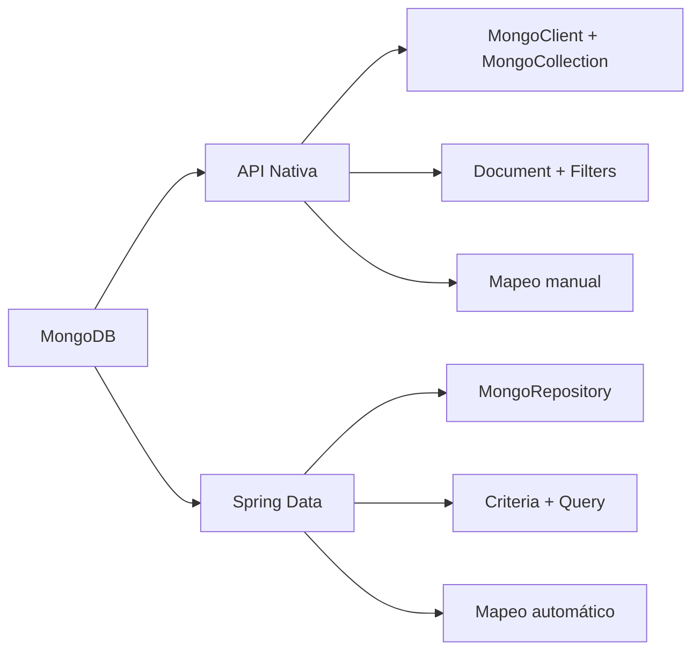

# Explicación de Métodos del Proyecto MongoDB — Para Presentar

## Resumen del Proyecto

El proyecto tiene **2 módulos** que hacen lo mismo pero de forma diferente:

| Módulo | Archivo Principal | Estilo |
|--------|------------------|--------|
| **API Nativa** | `NativeMongoUserServiceImpl.java` | Código manual, como JDBC puro |
| **Spring Data** | `SpringDataUserServiceImpl.java` | Abstracción automática, como JPA |

> **IMPORTANTE**: El README dice que hay **4 métodos TODO por módulo** (8 en total) que los alumnos deben implementar. Sin embargo, **en el código actual todos los métodos ya están implementados** (ya están resueltos). Los métodos "de alumnos" son los 4 últimos de cada módulo.

---

## Los 5 Métodos de Ejemplo (Ya Dados por el Profesor)

Estos **ya están hechos** y sirven para aprender cómo funciona MongoDB. Son iguales en ambos módulos:

### Ejemplo 0: `testConnection()` — Probar conexión
### Ejemplo 1: `createUser()` — Insertar un usuario (INSERT)
### Ejemplo 2: `findUserById()` — Buscar por ID (SELECT WHERE id = ?)
### Ejemplo 3: `updateUser()` — Actualizar campos (UPDATE)
### Ejemplo 4: `deleteUser()` — Eliminar (DELETE)

---

## Los 4 Métodos del Alumno — Explicación Detallada

Estos son los que **los alumnos deben implementar**. A continuación, cada uno explicado a fondo.

---

## MÉTODO 1: `findAll()` — Listar todos los usuarios

> **Dificultad**: ⭐ Básica  
> **Equivalente SQL**: `SELECT * FROM users`

### API Nativa (líneas 502-515 de `NativeMongoUserServiceImpl.java`)

```java
public List<User> findAll() {
    MongoCollection<Document> collection = getCollection();
    List<User> users = new ArrayList<>();

    try (MongoCursor<Document> cursor = collection.find().iterator()) {
        while (cursor.hasNext()) {
            users.add(mapDocumentToUser(cursor.next()));
        }
    }
    return users;
}
```

**¿Qué hace paso a paso?**
1. `getCollection()` → Obtiene la colección "users" de MongoDB (como abrir una tabla)
2. `collection.find()` → Ejecuta una búsqueda **sin filtros** (trae todo)
3. `.iterator()` → Devuelve un `MongoCursor`, un iterador para recorrer los documentos uno a uno
4. `try-with-resources` → Asegura que el cursor se cierra automáticamente (libera recursos)
5. `cursor.hasNext()` / `cursor.next()` → Recorre cada documento BSON
6. `mapDocumentToUser()` → Convierte el `Document` BSON en un objeto Java `User`

> **TIP**: El `try-with-resources` es importante: si no cierras el cursor, mantienes la conexión abierta innecesariamente.

### Spring Data (líneas 371-374 de `SpringDataUserServiceImpl.java`)

```java
public List<User> findAll() {
    return userRepository.findAll();
}
```

**¿Qué hace?** — ¡Una sola línea! `findAll()` ya viene heredado de `MongoRepository`. Spring Data genera la query automáticamente.

### Comparación

| Aspecto | API Nativa | Spring Data |
|---------|-----------|-------------|
| Líneas de código | ~10 | 1 |
| Mapeo manual | Sí (`mapDocumentToUser`) | No (automático) |
| Cursor manual | Sí (`MongoCursor`) | No |

---

## MÉTODO 2: `findUsersByDepartment()` — Buscar por departamento

> **Dificultad**: ⭐⭐ Media  
> **Equivalente SQL**: `SELECT * FROM users WHERE department = 'IT'`

### API Nativa (líneas 517-530 de `NativeMongoUserServiceImpl.java`)

```java
public List<User> findUsersByDepartment(String department) {
    MongoCollection<Document> collection = getCollection();
    List<User> users = new ArrayList<>();

    try (MongoCursor<Document> cursor = collection
            .find(Filters.eq("department", department))  // <-- EL FILTRO
            .iterator()) {
        while (cursor.hasNext()) {
            users.add(mapDocumentToUser(cursor.next()));
        }
    }
    return users;
}
```

**¿Qué hace paso a paso?**
1. Es igual que `findAll()`, pero con un **filtro**
2. `Filters.eq("department", department)` → Crea un filtro BSON equivalente a `{ department: "IT" }`
3. `collection.find(filtro)` → Solo devuelve documentos que cumplan el filtro
4. El resto es idéntico: iterar con cursor y mapear

> **NOTA**: `Filters.eq()` es la clase clave de la API nativa. `eq` = "equals" (igualdad). Hay muchos más: `Filters.gt()` (mayor que), `Filters.lt()` (menor que), `Filters.regex()` (expresión regular), etc.

### Spring Data (líneas 376-379 de `SpringDataUserServiceImpl.java`)

```java
public List<User> findUsersByDepartment(String department) {
    return userRepository.findByDepartment(department);
}
```

**¿Qué hace?** — Llama a `findByDepartment()`, un **Query Method** definido en `UserRepository.java`:

```java
List<User> findByDepartment(String department);
```

Spring Data **lee el nombre del método** y genera la query automáticamente:
- `findBy` → indica que es una búsqueda
- `Department` → indica que filtra por el campo `department`

---

## MÉTODO 3: `searchUsers()` — Búsqueda avanzada con filtros + paginación

> **Dificultad**: ⭐⭐⭐ Alta  
> **Equivalente SQL**:  
> ```sql
> SELECT * FROM users 
> WHERE name LIKE '%search%' AND department = 'IT' AND active = true
> ORDER BY name ASC 
> LIMIT 10 OFFSET 0
> ```

### API Nativa (líneas 532-575 de `NativeMongoUserServiceImpl.java`)

```java
public List<User> searchUsers(UserQueryDto query) {
    MongoCollection<Document> collection = getCollection();
    List<User> users = new ArrayList<>();
    List<Bson> filters = new ArrayList<>();

    // 1. CONSTRUIR FILTROS DINÁMICOS
    if (query.getName() != null && !query.getName().isEmpty()) {
        filters.add(Filters.regex("name", query.getName(), "i"));
    }
    if (query.getDepartment() != null && !query.getDepartment().isEmpty()) {
        filters.add(Filters.eq("department", query.getDepartment()));
    }
    if (query.getActive() != null) {
        filters.add(Filters.eq("active", query.getActive()));
    }

    Bson filter = filters.isEmpty() ? new Document() : Filters.and(filters);

    // 2. APLICAR FILTROS + SORT + PAGINACIÓN
    FindIterable<Document> findIterable = collection.find(filter);

    if (query.getPage() != null && query.getSize() != null) {
        findIterable.skip(query.getPage() * query.getSize())
                    .limit(query.getSize());
    }

    if (query.getSortBy() != null) {
        Bson sort = "DESC".equalsIgnoreCase(query.getSortDirection())
            ? Sorts.descending(query.getSortBy())
            : Sorts.ascending(query.getSortBy());
        findIterable.sort(sort);
    }

    try (MongoCursor<Document> cursor = findIterable.iterator()) {
        while (cursor.hasNext()) {
            users.add(mapDocumentToUser(cursor.next()));
        }
    }
    return users;
}
```

**¿Qué hace paso a paso?**

1. **Filtros dinámicos** — Solo añade filtros si el usuario los proporcionó:
   - `Filters.regex("name", texto, "i")` → Búsqueda parcial insensible a mayúsculas (como SQL `LIKE '%texto%'`). La `"i"` significa *case-insensitive*
   - `Filters.eq("department", dept)` → Igualdad exacta
   - `Filters.eq("active", true)` → Filtrar solo activos/inactivos

2. `Filters.and(filters)` → Combina todos los filtros con AND (todos deben cumplirse)

3. **Paginación** con `skip()` y `limit()`:
   - `skip(page * size)` → Salta los primeros N documentos (como OFFSET en SQL)
   - `limit(size)` → Solo devuelve N documentos (como LIMIT en SQL)
   - Ejemplo: página 2, tamaño 10 → `skip(20).limit(10)` → documentos 21-30

4. **Ordenamiento** con `Sorts`:
   - `Sorts.ascending("name")` → Ordena A-Z (ORDER BY name ASC)
   - `Sorts.descending("name")` → Ordena Z-A (ORDER BY name DESC)

> **IMPORTANTE**: Este es el método más complejo porque combina **3 conceptos**: filtros dinámicos, paginación y ordenamiento. Es lo más parecido a una query SQL avanzada.

### Spring Data (líneas 381-409 de `SpringDataUserServiceImpl.java`)

```java
public List<User> searchUsers(UserQueryDto query) {
    Query q = new Query();

    // 1. Filtros dinámicos con Criteria
    if (query.getName() != null && !query.getName().isEmpty()) {
        q.addCriteria(Criteria.where("name").regex(query.getName(), "i"));
    }
    if (query.getDepartment() != null && !query.getDepartment().isEmpty()) {
        q.addCriteria(Criteria.where("department").is(query.getDepartment()));
    }
    if (query.getActive() != null) {
        q.addCriteria(Criteria.where("active").is(query.getActive()));
    }

    // 2. Paginación
    if (query.getPage() != null && query.getSize() != null) {
        q.with(PageRequest.of(query.getPage(), query.getSize()));
    }

    // 3. Ordenamiento
    if (query.getSortBy() != null) {
        Sort.Direction direction = "DESC".equalsIgnoreCase(query.getSortDirection())
            ? Sort.Direction.DESC : Sort.Direction.ASC;
        q.with(Sort.by(direction, query.getSortBy()));
    }

    return mongoTemplate.find(q, User.class);
}
```

**Diferencias con API Nativa:**
- Usa `Criteria` en vez de `Filters` → `Criteria.where("name").regex(...)` vs `Filters.regex("name", ...)`
- Usa `PageRequest.of(page, size)` en vez de `skip()/limit()` manuales
- Usa `Sort.by(direction, field)` en vez de `Sorts.ascending/descending()`
- `mongoTemplate.find(q, User.class)` → Ejecuta la query y mapea automáticamente a `User`

---

## MÉTODO 4: `countByDepartment()` — Contar usuarios por departamento

> **Dificultad**: ⭐⭐-⭐⭐⭐ (depende del enfoque)  
> **Equivalente SQL**: `SELECT COUNT(*) FROM users WHERE department = 'IT'`

### API Nativa (líneas 577-582 de `NativeMongoUserServiceImpl.java`)

```java
public long countByDepartment(String department) {
    MongoCollection<Document> collection = getCollection();
    return collection.countDocuments(Filters.eq("department", department));
}
```

**¿Qué hace?**
- `countDocuments(filtro)` → Cuenta cuántos documentos cumplen el filtro, sin traerlos todos a memoria
- `Filters.eq("department", department)` → Filtra por departamento (igual que en `findUsersByDepartment`)

> **TIP**: Es más eficiente que hacer `findAll()` y luego `list.size()` porque MongoDB cuenta directamente en el servidor sin transferir datos.

### Spring Data (líneas 411-414 de `SpringDataUserServiceImpl.java`)

```java
public long countByDepartment(String department) {
    return userRepository.countByDepartment(department);
}
```

**¿Qué hace?** — Usa el Query Method `countByDepartment()` del `UserRepository.java` (línea 81):
- `countBy` → Spring Data entiende que es un COUNT
- `Department` → filtra por el campo `department`

---

## BONUS: `getStatsByDepartment()` — Aggregation Pipeline (Solo API Nativa)

> **Dificultad**: ⭐⭐⭐ Alta  
> Solo existe en la API Nativa como ejemplo avanzado.

```java
List<Bson> pipeline = List.of(
    Aggregates.group("$department",
        Accumulators.sum("totalUsers", 1),
        Accumulators.sum("activeUsers",
            new Document("$cond", List.of(
                new Document("$eq", List.of("$active", true)), 1, 0))
        )
    ),
    Aggregates.sort(Sorts.descending("totalUsers"))
);
```

**¿Qué hace?**
- Es un **pipeline de agregación** (como GROUP BY en SQL)
- `$group` → Agrupa documentos por departamento
- `$sum: 1` → Cuenta el total de usuarios por grupo
- `$cond` → Condición: si `active == true`, suma 1, si no, suma 0 (cuenta solo activos)
- `$sort` → Ordena por total de usuarios de mayor a menor

**Equivalente SQL**:
```sql
SELECT department, COUNT(*) as totalUsers,
       SUM(CASE WHEN active = true THEN 1 ELSE 0 END) as activeUsers
FROM users
GROUP BY department
ORDER BY totalUsers DESC
```

---

## Resumen Final para la Presentación



| Método | API Nativa (manual) | Spring Data (automático) |
|--------|-------------------|------------------------|
| `findAll()` | `collection.find()` + cursor + mapeo | `repository.findAll()` |
| `findUsersByDepartment()` | `Filters.eq()` + cursor + mapeo | `repository.findByDepartment()` |
| `searchUsers()` | `Filters.and()` + `skip/limit` + `Sorts` | `Criteria` + `PageRequest` + `Sort` |
| `countByDepartment()` | `countDocuments(Filters.eq(...))` | `repository.countByDepartment()` |

> **Conclusión para la presentación**: La API Nativa requiere más código pero te da control total y entiendes qué pasa internamente. Spring Data reduce el código un 90% pero oculta la complejidad ("magia"). Lo ideal es **aprender primero con la API Nativa** y luego usar Spring Data para ser productivo.
